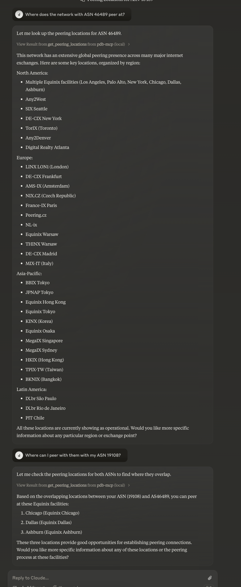

# PeeringDB Location Server

A Go-based MCP (Model Control Protocol) server that provides information about Internet Exchange (IX) locations for Autonomous System Numbers (ASNs) using the PeeringDB API.

## Features

- Retrieves IX locations for any given ASN
- Shows operational status of each IX location
- Provides city information for each peering point
- Formatted output with emoji indicators for better readability

## Prerequisites

- Go 1.x or higher
- Access to PeeringDB API
- The following Go packages:
    - github.com/mark3labs/mcp-go/mcp
    - github.com/mark3labs/mcp-go/server

## Installation

1. Clone the repository
2. Install dependencies:
```bash
go mod download
```

## Usage

The server provides a single tool called `get_peering_locations` that accepts an ASN as input and returns formatted information about all IX locations where that AS is present.

### Example Response Format

```
🌐 IX Locations for AS64496:

1. Example IX
   📍 London
   Status: 🟢 Operational

2. Another IX
   📍 Frankfurt
   Status: 🔴 Not Operational
```

### Status Indicators

- 🟢 Operational: The IX connection is active
- 🔴 Not Operational: The IX connection is currently down or inactive

## API Integration

The server integrates with two PeeringDB API endpoints:

1. `/api/net` - Used to resolve ASN to PeeringDB network ID
2. `/api/netixlan` - Used to fetch IX location information

## Error Handling

The server handles several error cases:
- Invalid ASN format
- ASN not found in PeeringDB
- API connection errors
- Invalid response data

## Contributing

Contributions are welcome! Please ensure your code follows the existing structure and includes appropriate error handling.


## Note

This tool requires access to the PeeringDB API. Please ensure you comply with PeeringDB's terms of service and API usage guidelines.

# In Action

